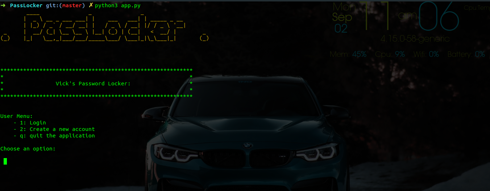

# PassLocker
A python application that allows a user to create a new account , login to the account using their username and password, store passwords with their respective accounts and generate passwords for the user

## Author
> Victor Waichigo K.

## Screenshots

## Installations

## Setup

## Technologies used
* Python3
* pyFiglet

## BDD(Behaviour Driven Development)
> Login inputs

| Inputs |  Description |
| :---         |          ---: |
| Username  | Account username, ``eg username``|
| Password  | Account password, ``eg password``|

>Account Inputs

| Inputs |  Description |
| :---         |          ---: |
| Account  | Account name, ``eg Linkedin``|
| Username  | Account username, ``eg username``|
| Password  | Account password, ``eg password``|

| Outputs |  Description |
| :---         |          ---: |
| Random generated passwords  | Passwords generated by the application.|
| User accounts with their credentials  |  Stored user accounts and their passwords |
|     |      |

## License
> MIT License &copy 2019 Victor 

## Collaborate
To collaborate, reach me on [waichigovick@gmail.com]()

